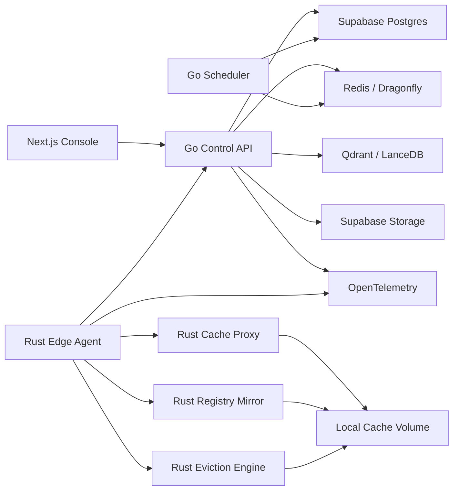

# off-planet-cdn-simulator

> Off-planet CDN simulator – priority-aware caching simulator for Moon/Mars habitats where bandwidth is extremely scarce

## Implementation Status

**Sprint S1 complete — 2026-05-07** | ~163 files scaffolded across all layers.

| Layer | What's built | Sprint |
|---|---|---|
| Monorepo | `package.json`, `turbo.json`, `Makefile`, `docker-compose.yml`, `go.work`, `.env.example`, CI workflows (Go/Rust/Web/Docker/Security), OTel Collector config, infra scripts | S1 ✅ |
| Supabase | All 28 tables across 7 migrations, RLS org-isolation policies, monthly partitions for heartbeats + telemetry, demo seed data | S1 ✅ |
| Go control API | `control-api`, `scheduler`, `telemetry-ingest`, `policy-engine`, `mcp-server` skeletons — health endpoints, config, middleware, OpenAPI spec, Dockerfiles | S1 ✅ |
| Rust edge | 7-crate workspace — `shared` types/errors/crypto/manifests, `edge-agent` + `cache-proxy` Axum skeletons, `eviction-engine` with scoring formula + 11 unit tests, registry/indexer/wasm stubs | S1 ✅ |
| Next.js | 27-page app (13 admin + 12 user portal), Supabase auth middleware, `Badge` component + vitest tests, `api-client`, Zod validators, JS SDK, 4 JSON schemas | S1 ✅ |
| Go SDK | `packages/sdk-go` typed client + API types | S1 ✅ |

**S2 complete (2026-05-07):** Real Postgres handlers for sites, nodes, heartbeat — DB query layer, `OrgID` context middleware, `JWTAuth` middleware, 9 integration tests in `tests/integration/`.

**S3 complete (2026-05-07):** Rust edge-agent fully live — 30s heartbeat loop, 15s preload-job poll, content-addressable `fetch_object`, full local API (`/local/cache/status` with real disk measurement, `/local/cache/fetch`, `/local/cache/preload`, `/local/policy/reload`), 7 Axum router tests. Build: ✅ clean.

**S4 complete (2026-05-07):** Cache objects (CRUD + pin/unpin + audit log), policies (CRUD), preload jobs (create → Redis enqueue → cancel), telemetry ingest, audit log list. OTel exporter path fixed (`otlptracehttp v1.24.0`). Build: ✅ `go build ./...` clean.

**Next:** S5 — Go scheduler dispatch (contact-window check + priority-ordered job delivery to edge).

See [`docs/dev-docs/progress.md`](docs/dev-docs/progress.md) for full sprint tracking.
See [`docs/dev-docs/plan.md`](docs/dev-docs/plan.md) for the complete implementation and testing plan.

---

## Overview

A content-distribution simulator for Moon/Mars habitats, research bases, and remote terrestrial regions.

## Getting Started

```bash
# Clone the repo
git clone https://github.com/quantumworld-dpdns-io/off-planet-cdn-simulator.git
cd off-planet-cdn-simulator
```

What it does:
Optimizes what data should be cached locally when bandwidth is scarce and latency is extreme.

Core feature:

Priority-aware caching
Medical/engineering/manuals-first policy
Entertainment and education prefetching
Cache eviction under mission constraints
Local model/package registry mirror

Wild angle:
A CDN designed for places where “refresh the page” may cost minutes, hours, or mission-critical bandwidth.

## Project Structure

```text
.
├── src/          # Application source code
├── docs/         # Architecture decisions, API specs, runbooks
├── tests/        # Unit / integration / e2e tests
└── .github/
    └── workflows/ # CI/CD pipelines
```

## Contributing

Please read [CONTRIBUTING.md](docs/CONTRIBUTING.md) before opening a pull request.

## License

[MIT](LICENSE)
A CDN/control-plane system for environments where bandwidth is scarce, latency is extreme, and refresh/retry may be operationally expensive.

Use cases:

Lunar / Mars habitat content cache
Remote disaster-zone mesh cache
Ship / aircraft / research station offline CDN
Campus / hospital emergency cache
Local model/package/document registry mirror
Mission-critical manual and medical document preloading

1. Recommended tech stack
Core architecture
Layer    Stack    Role
Frontend    Next.js    Admin console + user portal
Backend API    Go    Control plane, policy API, scheduler, auth integration, Supabase integration
Edge runtime    Rust    High-performance cache agent, eviction engine, registry mirror, local proxy
Database    Supabase Postgres    Metadata, policies, tenants, audit logs, cache catalog
Auth    Supabase Auth + RLS    User/admin auth, org isolation, role-based access
Object storage    Supabase Storage / S3-compatible storage    Content manifests, metadata exports, cache reports
Hot cache / queues    Redis or Dragonfly    Priority queues, leases, job state, node heartbeats
Vector search    Qdrant or LanceDB    Semantic search over manuals, packages, models, mission docs
Local analytics    DuckDB + Apache Arrow    Offline cache analytics, content popularity, bandwidth reports
Rust analytics engine    Apache DataFusion    Embedded query engine inside Rust edge/control tools
Observability    OpenTelemetry    Distributed tracing, cache decision traces, agent telemetry
Runtime security    Cilium Tetragon    Edge-node runtime visibility and enforcement
Plugin sandbox    Wasmtime + WASI    Safe policy plugins and custom cache scoring functions
AI local assistant    Ollama / llama.cpp / vLLM    Local summarization, cache recommendation, admin copilot
Agent integration    MCP + OpenAPI Tool Calling    Let AI agents call cache, policy, simulation, and audit tools
Future crypto    PQC Libraries, RISC Zero, Noir    Quantum-safe comms, verifiable cache proofs, proof-of-delivery
Future confidential compute    Apache Teaclave    TEE-based handling of sensitive manifests or private mission data
2. Product modules
A. Control Plane

Built mainly in Go.

Responsibilities:

Organization / mission / site management
Cache policy management
Bandwidth window modeling
Priority-aware preload scheduling
Cache eviction simulation
Node inventory and health
Audit logs
Admin API
Supabase Auth + Postgres integration

Example services:

control-api
scheduler
telemetry-ingest
policy-engine
mirror-orchestrator
B. Edge Plane

Built mainly in Rust.

Responsibilities:

Local cache proxy
Content fetcher
Eviction engine
Manifest validator
Package/model registry mirror
Local offline search index
Node heartbeat
Bandwidth-aware sync
WASM policy plugin execution

Example services:

edge-agent
cache-proxy
eviction-engine
registry-mirror
content-indexer
wasm-policy-runner
C. Frontend

Built in Next.js.

Two surfaces:

Admin console

For mission operators, infrastructure engineers, and security teams.

Pages:

/admin/dashboard
/admin/sites
/admin/nodes
/admin/cache-policies
/admin/content-catalog
/admin/preload-jobs
/admin/eviction-simulator
/admin/bandwidth-windows
/admin/package-mirrors
/admin/model-mirrors
/admin/incidents
/admin/audit-logs
/admin/settings
User portal

For field users, crew, engineers, medical staff, or offline-site users.

Pages:

/app/home
/app/search
/app/manuals
/app/medical
/app/engineering
/app/education
/app/entertainment
/app/packages
/app/models
/app/downloads
/app/offline-status
3. Useful tools from software-tools.zip
Tool / concept    Use in this project    Priority
Redis / Dragonfly    Cache metadata, sync queues, priority queues, node heartbeat, leases    MVP
Qdrant / LanceDB    Semantic retrieval over manuals, engineering docs, medical content, cached models    MVP
DuckDB    Local analytics on cache hit/miss logs and bandwidth usage    MVP
Apache Arrow    Efficient columnar interchange between Rust analytics and local reports    MVP
Apache DataFusion    Rust-native analytical queries inside edge agent or reporting service    Phase 2
OpenTelemetry    Trace cache decisions, agent sync behavior, failed fetches, model recommendations    MVP
MCP    Let an AI/admin agent query cache status, generate preload plans, inspect incidents    Phase 2
OpenAPI Tool Calling    Expose safe HTTP tools to agents and admin automations    Phase 2
Ollama / llama.cpp    Local model for summarizing documents and generating cache recommendations offline    Phase 2
vLLM / SGLang    High-throughput central model serving if deployed in stronger infra    Phase 3
Wasmtime / WASI    Run custom cache-priority and eviction plugins safely    Phase 2
Fermyon Spin    Lightweight edge functions for custom filters or local tools    Optional
Cilium Tetragon    Runtime visibility for edge nodes and cache agents    Phase 2
PQC Libraries    Quantum-safe signing / key exchange for long-life comms    Phase 3
RISC Zero / Noir    Proof of cache integrity, proof of contact, proof of delivery    Phase 3
Apache Teaclave    Confidential computation for sensitive manifests or mission/private data    Phase 3
Flower / NVIDIA FLARE    Federated learning for cache prediction across disconnected sites    Experimental
Iceberg / Polaris / Trino    Long-term lakehouse for multi-site telemetry and mission analytics    Phase 3
4. System architecture
5. Main caching model
Priority classes
Priority    Example content    Default policy
P0    Emergency medical procedures, air/water/power repair, safety alerts    Always pinned
P1    Engineering manuals, rover/habitat maintenance, mission runbooks    Strongly retained
P2    Education, training, language, scientific references    Prefetch during good windows
P3    Local model weights, package registry mirror, SDKs    Retain based on mission profile
P4    Entertainment, media, non-critical archives    Evict first
P5    Expired, duplicate, stale, low-demand content    Candidate for removal
Cache score formula

A practical initial score:

```text
cache_score =
  priority_weight
+ mission_relevance
+ predicted_demand
+ offline_criticality
+ revalidation_cost
+ fetch_latency_cost
+ package_dependency_score
- size_penalty
- staleness_penalty
- redundancy_penalty
```

In MVP, implement this in Rust.
In Phase 2, allow custom scoring with Wasmtime/WASI policy plugins.

1. Supabase database model

Recommended tables:

orgs
profiles
roles
sites
nodes
node_heartbeats
cache_objects
cache_object_versions
cache_object_tags
priority_classes
cache_policies
cache_policy_rules
cache_decisions
preload_jobs
preload_job_items
eviction_runs
eviction_candidates
bandwidth_windows
contact_windows
mirror_sources
mirror_artifacts
package_registries
model_registries
content_requests
telemetry_events
incidents
audit_logs
wasm_plugins
agent_tool_calls

Important Supabase features:

RLS for org_id tenant isolation
Supabase Auth for admin/user roles
Supabase Storage for manifests, reports, exported cache plans
Realtime for node health and preload-job status
Edge Functions optional for lightweight webhook handlers
7. API design
Go control API
GET    /v1/health

GET    /v1/orgs/current
GET    /v1/sites
POST   /v1/sites
GET    /v1/sites/:site_id

GET    /v1/nodes
POST   /v1/nodes/register
POST   /v1/nodes/:node_id/heartbeat
GET    /v1/nodes/:node_id/status

GET    /v1/cache/objects
POST   /v1/cache/objects
GET    /v1/cache/objects/:object_id
POST   /v1/cache/objects/:object_id/pin
POST   /v1/cache/objects/:object_id/unpin

GET    /v1/policies
POST   /v1/policies
PUT    /v1/policies/:policy_id

POST   /v1/preload/jobs
GET    /v1/preload/jobs
GET    /v1/preload/jobs/:job_id
POST   /v1/preload/jobs/:job_id/cancel

POST   /v1/eviction/simulate
POST   /v1/eviction/run

GET    /v1/bandwidth-windows
POST   /v1/bandwidth-windows

GET    /v1/mirrors/sources
POST   /v1/mirrors/sources
POST   /v1/mirrors/sync

POST   /v1/telemetry/events
GET    /v1/audit-logs
Rust edge-agent API
GET    /local/health
GET    /local/cache/status
POST   /local/cache/fetch
POST   /local/cache/preload
POST   /local/cache/evict
POST   /local/mirror/sync
POST   /local/policy/reload
GET    /local/search
8. Full project structure
offplanet-cdn/
├── README.md
├── LICENSE
├── .env.example
├── .gitignore
├── Makefile
├── docker-compose.yml
├── turbo.json
├── pnpm-workspace.yaml
├── package.json
│
├── apps/
│   ├── web/
│   │   ├── package.json
│   │   ├── next.config.ts
│   │   ├── middleware.ts
│   │   ├── src/
│   │   │   ├── app/
│   │   │   │   ├── layout.tsx
│   │   │   │   ├── page.tsx
│   │   │   │   ├── login/
│   │   │   │   │   └── page.tsx
│   │   │   │   ├── admin/
│   │   │   │   │   ├── layout.tsx
│   │   │   │   │   ├── dashboard/
│   │   │   │   │   │   └── page.tsx
│   │   │   │   │   ├── sites/
│   │   │   │   │   │   ├── page.tsx
│   │   │   │   │   │   └── [siteId]/page.tsx
│   │   │   │   │   ├── nodes/
│   │   │   │   │   │   ├── page.tsx
│   │   │   │   │   │   └── [nodeId]/page.tsx
│   │   │   │   │   ├── cache-policies/
│   │   │   │   │   │   ├── page.tsx
│   │   │   │   │   │   └── [policyId]/page.tsx
│   │   │   │   │   ├── content-catalog/
│   │   │   │   │   │   ├── page.tsx
│   │   │   │   │   │   └── [objectId]/page.tsx
│   │   │   │   │   ├── preload-jobs/
│   │   │   │   │   │   ├── page.tsx
│   │   │   │   │   │   └── [jobId]/page.tsx
│   │   │   │   │   ├── eviction-simulator/
│   │   │   │   │   │   └── page.tsx
│   │   │   │   │   ├── bandwidth-windows/
│   │   │   │   │   │   └── page.tsx
│   │   │   │   │   ├── package-mirrors/
│   │   │   │   │   │   └── page.tsx
│   │   │   │   │   ├── model-mirrors/
│   │   │   │   │   │   └── page.tsx
│   │   │   │   │   ├── incidents/
│   │   │   │   │   │   └── page.tsx
│   │   │   │   │   ├── audit-logs/
│   │   │   │   │   │   └── page.tsx
│   │   │   │   │   └── settings/
│   │   │   │   │       └── page.tsx
│   │   │   │   └── app/
│   │   │   │       ├── layout.tsx
│   │   │   │       ├── home/page.tsx
│   │   │   │       ├── search/page.tsx
│   │   │   │       ├── manuals/page.tsx
│   │   │   │       ├── medical/page.tsx
│   │   │   │       ├── engineering/page.tsx
│   │   │   │       ├── education/page.tsx
│   │   │   │       ├── entertainment/page.tsx
│   │   │   │       ├── packages/page.tsx
│   │   │   │       ├── models/page.tsx
│   │   │   │       ├── downloads/page.tsx
│   │   │   │       └── offline-status/page.tsx
│   │   │   ├── components/
│   │   │   │   ├── charts/
│   │   │   │   ├── forms/
│   │   │   │   ├── layout/
│   │   │   │   ├── tables/
│   │   │   │   └── ui/
│   │   │   ├── lib/
│   │   │   │   ├── api-client.ts
│   │   │   │   ├── supabase-browser.ts
│   │   │   │   ├── supabase-server.ts
│   │   │   │   ├── auth.ts
│   │   │   │   └── validators.ts
│   │   │   ├── hooks/
│   │   │   ├── styles/
│   │   │   └── types/
│   │   └── public/
│   │
│   └── docs-site/
│       └── README.md
│
├── services/
│   ├── control-api/
│   │   ├── cmd/api/main.go
│   │   ├── internal/
│   │   │   ├── auth/
│   │   │   ├── config/
│   │   │   ├── db/
│   │   │   ├── handlers/
│   │   │   ├── middleware/
│   │   │   ├── models/
│   │   │   ├── routes/
│   │   │   ├── supabase/
│   │   │   └── telemetry/
│   │   ├── api/openapi.yaml
│   │   ├── go.mod
│   │   └── Dockerfile
│   │
│   ├── scheduler/
│   │   ├── cmd/scheduler/main.go
│   │   ├── internal/
│   │   │   ├── contactwindows/
│   │   │   ├── optimizer/
│   │   │   ├── queues/
│   │   │   └── telemetry/
│   │   ├── go.mod
│   │   └── Dockerfile
│   │
│   ├── telemetry-ingest/
│   │   ├── cmd/telemetry-ingest/main.go
│   │   ├── internal/
│   │   │   ├── ingest/
│   │   │   ├── normalize/
│   │   │   └── storage/
│   │   ├── go.mod
│   │   └── Dockerfile
│   │
│   ├── policy-engine/
│   │   ├── cmd/policy-engine/main.go
│   │   ├── internal/
│   │   │   ├── scoring/
│   │   │   ├── rules/
│   │   │   ├── simulator/
│   │   │   └── wasm/
│   │   ├── go.mod
│   │   └── Dockerfile
│   │
│   └── mcp-server/
│       ├── cmd/mcp-server/main.go
│       ├── internal/tools/
│       │   ├── cache_status.go
│       │   ├── generate_preload_plan.go
│       │   ├── inspect_node.go
│       │   ├── simulate_eviction.go
│       │   └── summarize_incident.go
│       ├── go.mod
│       └── README.md
│
├── edge/
│   ├── Cargo.toml
│   ├── crates/
│   │   ├── edge-agent/
│   │   │   ├── Cargo.toml
│   │   │   └── src/
│   │   │       ├── main.rs
│   │   │       ├── config.rs
│   │   │       ├── heartbeat.rs
│   │   │       ├── sync.rs
│   │   │       ├── api.rs
│   │   │       └── telemetry.rs
│   │   │
│   │   ├── cache-proxy/
│   │   │   ├── Cargo.toml
│   │   │   └── src/
│   │   │       ├── main.rs
│   │   │       ├── proxy.rs
│   │   │       ├── fetch.rs
│   │   │       ├── range_requests.rs
│   │   │       ├── revalidate.rs
│   │   │       └── headers.rs
│   │   │
│   │   ├── eviction-engine/
│   │   │   ├── Cargo.toml
│   │   │   └── src/
│   │   │       ├── lib.rs
│   │   │       ├── score.rs
│   │   │       ├── constraints.rs
│   │   │       ├── simulator.rs
│   │   │       └── tests.rs
│   │   │
│   │   ├── registry-mirror/
│   │   │   ├── Cargo.toml
│   │   │   └── src/
│   │   │       ├── main.rs
│   │   │       ├── npm.rs
│   │   │       ├── crates_io.rs
│   │   │       ├── pypi.rs
│   │   │       ├── oci.rs
│   │   │       ├── model_registry.rs
│   │   │       └── manifest.rs
│   │   │
│   │   ├── content-indexer/
│   │   │   ├── Cargo.toml
│   │   │   └── src/
│   │   │       ├── main.rs
│   │   │       ├── chunk.rs
│   │   │       ├── embeddings.rs
│   │   │       ├── qdrant.rs
│   │   │       └── duckdb_export.rs
│   │   │
│   │   ├── wasm-policy-runner/
│   │   │   ├── Cargo.toml
│   │   │   └── src/
│   │   │       ├── lib.rs
│   │   │       ├── host.rs
│   │   │       ├── wit.rs
│   │   │       └── runtime.rs
│   │   │
│   │   └── shared/
│   │       ├── Cargo.toml
│   │       └── src/
│   │           ├── types.rs
│   │           ├── errors.rs
│   │           ├── crypto.rs
│   │           ├── manifests.rs
│   │           └── telemetry.rs
│   │
│   └── examples/
│       ├── sample-cache-manifest.json
│       ├── sample-bandwidth-window.json
│       └── sample-policy.toml
│
├── packages/
│   ├── sdk-js/
│   │   ├── package.json
│   │   └── src/
│   │       ├── client.ts
│   │       ├── types.ts
│   │       └── index.ts
│   │
│   ├── sdk-go/
│   │   ├── go.mod
│   │   └── offcdn/
│   │       ├── client.go
│   │       └── types.go
│   │
│   └── shared-schemas/
│       ├── cache-object.schema.json
│       ├── cache-policy.schema.json
│       ├── node-heartbeat.schema.json
│       └── preload-job.schema.json
│
├── wasm-plugins/
│   ├── README.md
│   ├── wit/
│   │   └── cache-policy.wit
│   ├── examples/
│   │   ├── medical_first/
│   │   │   ├── Cargo.toml
│   │   │   └── src/lib.rs
│   │   ├── entertainment_last/
│   │   │   ├── Cargo.toml
│   │   │   └── src/lib.rs
│   │   └── package_dependency_boost/
│   │       ├── Cargo.toml
│   │       └── src/lib.rs
│
├── supabase/
│   ├── config.toml
│   ├── migrations/
│   │   ├── 0001_init.sql
│   │   ├── 0002_rls.sql
│   │   ├── 0003_cache_objects.sql
│   │   ├── 0004_policies.sql
│   │   ├── 0005_jobs.sql
│   │   ├── 0006_telemetry.sql
│   │   └── 0007_audit_logs.sql
│   ├── seed.sql
│   └── functions/
│       ├── webhook-node-alert/
│       └── export-cache-report/
│
├── infra/
│   ├── docker/
│   │   ├── control-api.Dockerfile
│   │   ├── edge-agent.Dockerfile
│   │   ├── cache-proxy.Dockerfile
│   │   └── scheduler.Dockerfile
│   ├── k8s/
│   │   ├── namespace.yaml
│   │   ├── control-api.yaml
│   │   ├── scheduler.yaml
│   │   ├── telemetry-ingest.yaml
│   │   ├── redis.yaml
│   │   ├── qdrant.yaml
│   │   └── otel-collector.yaml
│   ├── tetragon/
│   │   ├── tracing-policy-cache-agent.yaml
│   │   └── tracing-policy-sensitive-files.yaml
│   ├── terraform/
│   │   ├── supabase/
│   │   ├── cloudflare/
│   │   └── object-storage/
│   └── scripts/
│       ├── dev-up.sh
│       ├── dev-down.sh
│       ├── seed-demo.sh
│       ├── build-edge.sh
│       └── sync-demo-content.sh
│
├── docs/
│   ├── architecture.md
│   ├── cache-scoring.md
│   ├── eviction-policy.md
│   ├── bandwidth-window-model.md
│   ├── registry-mirror.md
│   ├── offline-mode.md
│   ├── security-model.md
│   ├── observability.md
│   ├── mcp-tools.md
│   ├── database-schema.md
│   └── roadmap.md
│
├── testdata/
│   ├── manuals/
│   │   ├── medical/
│   │   ├── engineering/
│   │   ├── education/
│   │   └── entertainment/
│   ├── packages/
│   ├── models/
│   └── telemetry/
│
└── .github/
    └── workflows/
        ├── ci.yml
        ├── go.yml
        ├── rust.yml
        ├── web.yml
        ├── docker.yml
        └── security.yml
9. Suggested README.md

## Off-Planet CDN

A mission-aware CDN and local cache control system for environments where bandwidth is scarce, latency is extreme, and refresh/retry may consume mission-critical resources.

Off-Planet CDN optimizes what data should be cached locally before, during, and after limited communication windows. It prioritizes emergency medical content, engineering manuals, operational runbooks, local model files, package registries, education content, and low-priority entertainment content according to mission constraints.

## What it does

Optimizes what data should be cached locally when bandwidth is scarce and latency is extreme.

Core features:

+ Priority-aware caching
+ Medical / engineering / manuals-first policy
+ Entertainment and education prefetching
+ Cache eviction under mission constraints
+ Local model registry mirror
+ Local package registry mirror
+ Offline-first search
+ Bandwidth-window-aware preload scheduling
+ Cache simulation before eviction
+ Admin console for mission/cache operators
+ User portal for offline-site users

Wild angle:

> A CDN designed for places where “refresh the page” may cost minutes, hours, or mission-critical bandwidth.

## Use cases

+ Lunar or Mars habitat content cache
+ Space mission comms simulation
+ Remote research station offline CDN
+ Ship, aircraft, or polar station local cache
+ Disaster-zone communication cache
+ Hospital or campus emergency knowledge cache
+ Local model/package/document mirror for disconnected engineering teams

## Architecture

Off-Planet CDN is split into three planes:

1. Frontend Plane
   + Next.js admin console
   + Next.js user portal

2. Control Plane
   + Go API services
   + Supabase Postgres metadata
   + Supabase Auth and RLS
   + Scheduler and policy engine
   + Telemetry ingestion
   + Mirror orchestration

3. Edge Plane
   + Rust cache agent
   + Rust local cache proxy
   + Rust eviction engine
   + Rust package/model registry mirror
   + Optional WASM policy plugins through Wasmtime/WASI



## Tech stack

Frontend
Next.js
TypeScript
Tailwind CSS
Supabase Auth client
Recharts or similar dashboard charts
Zod for runtime validation
Backend
Go
Supabase Postgres
Supabase Auth
Supabase Storage
Redis or Dragonfly
OpenAPI
OpenTelemetry
Edge runtime
Rust
Tokio
Axum
Reqwest
Wasmtime / WASI for policy plugins
DuckDB / Arrow for local analytics
DataFusion for embedded analytical queries
Qdrant or LanceDB for semantic retrieval
AI and agent layer
MCP server for admin automation
OpenAPI tool calling
Ollama or llama.cpp for local/offline assistant
vLLM or SGLang for high-throughput central inference
Arize Phoenix / Weave / Braintrust / LangSmith for AI evaluation and tracing, when AI-assisted cache decisions are enabled
Security and observability
OpenTelemetry
Cilium Tetragon for runtime visibility
PQC libraries for future quantum-safe links
RISC Zero or Noir for future proof-of-cache / proof-of-contact workflows
Apache Teaclave for future confidential compute workflows
Priority model

Content is classified into priority classes.

Priority    Content type    Default behavior
P0    Emergency medical procedures, safety alerts, life-support manuals    Always pinned
P1    Engineering manuals, repair guides, mission runbooks    Strongly retained
P2    Education, training, scientific references    Prefetch during good bandwidth windows
P3    Package registries, model files, SDKs    Retain according to mission profile
P4    Entertainment and non-critical media    Evict first
P5    Expired, duplicate, stale, low-demand content    Candidate for removal
Cache scoring

Initial scoring model:

```text
cache_score =
  priority_weight
+ mission_relevance
+ predicted_demand
+ offline_criticality
+ revalidation_cost
+ fetch_latency_cost
+ package_dependency_score
- size_penalty
- staleness_penalty
- redundancy_penalty
```

The MVP implements this directly in Rust.

A later version supports custom scoring plugins using Wasmtime/WASI.

Core services
services/control-api       Go REST API for frontend, agents, policies, jobs
services/scheduler         Go scheduler for preload and sync jobs
services/telemetry-ingest  Go telemetry ingestion service
services/policy-engine     Go policy evaluation and simulation service
services/mcp-server        Go MCP server for admin/AI tools

edge/crates/edge-agent       Rust edge node daemon
edge/crates/cache-proxy      Rust local HTTP cache proxy
edge/crates/eviction-engine  Rust eviction scoring and simulator
edge/crates/registry-mirror  Rust package/model registry mirror
edge/crates/content-indexer  Rust document indexing and embedding worker
edge/crates/wasm-policy-runner Rust WASM policy plugin runner
Admin pages
/admin/dashboard
/admin/sites
/admin/nodes
/admin/cache-policies
/admin/content-catalog
/admin/preload-jobs
/admin/eviction-simulator
/admin/bandwidth-windows
/admin/package-mirrors
/admin/model-mirrors
/admin/incidents
/admin/audit-logs
/admin/settings
User pages
/app/home
/app/search
/app/manuals
/app/medical
/app/engineering
/app/education
/app/entertainment
/app/packages
/app/models
/app/downloads
/app/offline-status
Database tables
orgs
profiles
roles
sites
nodes
node_heartbeats
cache_objects
cache_object_versions
cache_object_tags
priority_classes
cache_policies
cache_policy_rules
cache_decisions
preload_jobs
preload_job_items
eviction_runs
eviction_candidates
bandwidth_windows
contact_windows
mirror_sources
mirror_artifacts
package_registries
model_registries
content_requests
telemetry_events
incidents
audit_logs
wasm_plugins
agent_tool_calls
API overview
Control API
GET    /v1/health

GET    /v1/sites
POST   /v1/sites
GET    /v1/sites/:site_id

GET    /v1/nodes
POST   /v1/nodes/register
POST   /v1/nodes/:node_id/heartbeat
GET    /v1/nodes/:node_id/status

GET    /v1/cache/objects
POST   /v1/cache/objects
GET    /v1/cache/objects/:object_id
POST   /v1/cache/objects/:object_id/pin
POST   /v1/cache/objects/:object_id/unpin

GET    /v1/policies
POST   /v1/policies
PUT    /v1/policies/:policy_id

POST   /v1/preload/jobs
GET    /v1/preload/jobs
GET    /v1/preload/jobs/:job_id
POST   /v1/preload/jobs/:job_id/cancel

POST   /v1/eviction/simulate
POST   /v1/eviction/run

GET    /v1/bandwidth-windows
POST   /v1/bandwidth-windows

GET    /v1/mirrors/sources
POST   /v1/mirrors/sources
POST   /v1/mirrors/sync

POST   /v1/telemetry/events
GET    /v1/audit-logs
Local edge API
GET    /local/health
GET    /local/cache/status
POST   /local/cache/fetch
POST   /local/cache/preload
POST   /local/cache/evict
POST   /local/mirror/sync
POST   /local/policy/reload
GET    /local/search
Repository structure
offplanet-cdn/
├── apps/
│   └── web/                    # Next.js admin console and user portal
├── services/
│   ├── control-api/            # Go control API
│   ├── scheduler/              # Go preload/contact-window scheduler
│   ├── telemetry-ingest/       # Go telemetry ingestion service
│   ├── policy-engine/          # Go policy evaluation and simulation
│   └── mcp-server/             # MCP tools for AI/admin automation
├── edge/
│   └── crates/
│       ├── edge-agent/         # Rust edge daemon
│       ├── cache-proxy/        # Rust local cache proxy
│       ├── eviction-engine/    # Rust scoring and eviction engine
│       ├── registry-mirror/    # Rust package/model registry mirror
│       ├── content-indexer/    # Rust document and embedding indexer
│       ├── wasm-policy-runner/ # Wasmtime/WASI policy runner
│       └── shared/             # Shared Rust types and utilities
├── packages/
│   ├── sdk-js/                 # JavaScript/TypeScript SDK
│   ├── sdk-go/                 # Go SDK
│   └── shared-schemas/         # JSON schemas
├── wasm-plugins/               # Custom cache policy plugins
├── supabase/                   # Migrations, RLS, seed data, functions
├── infra/                      # Docker, Kubernetes, Terraform, Tetragon
├── docs/                       # Architecture and design docs
├── testdata/                   # Demo manuals, packages, models, telemetry
└── .github/workflows/          # CI/CD
Local development
Requirements
Node.js
pnpm
Go
Rust
Docker
Supabase CLI
Redis or Dragonfly
Qdrant or LanceDB
Optional: Ollama
Optional: OpenTelemetry Collector
Start local services
cp .env.example .env
docker compose up -d
supabase start
make db-migrate
make seed
Start frontend
pnpm install
pnpm dev:web
Start Go control API
cd services/control-api
go run ./cmd/api
Start Rust edge agent
cd edge
cargo run -p edge-agent
Start Rust cache proxy
cd edge
cargo run -p cache-proxy
MVP roadmap
Phase 0 — Repo bootstrap
Monorepo setup
Next.js app shell
Go control API skeleton
Rust edge-agent skeleton
Supabase migrations
Docker Compose
Phase 1 — Functional cache control
Register edge nodes
Create content catalog
Define priority classes
Create cache policies
Submit preload jobs
Track node heartbeat
Execute local cache fetch
Show cache status in admin dashboard
Phase 2 — Eviction and simulation
Implement Rust eviction engine
Add eviction simulator page
Add bandwidth window model
Add preload optimizer
Add audit logs
Add local DuckDB analytics
Phase 3 — Registry mirrors
NPM mirror
PyPI mirror
crates.io mirror
OCI image mirror
Local model registry mirror
Phase 4 — AI and agentic operations
MCP server
Cache recommendation agent
Offline document summarization
Semantic search with Qdrant/LanceDB
OpenTelemetry traces for AI-assisted decisions
Phase 5 — Security and verifiability
Tetragon runtime monitoring
WASM policy plugin sandbox
PQC-ready signing layer
Proof-of-cache prototype with RISC Zero or Noir
Confidential manifest handling with Teaclave
Security model

Core security goals:

Prevent unauthorized policy changes
Prevent accidental eviction of mission-critical data
Preserve auditability of cache decisions
Isolate organization and site data with Supabase RLS
Sign cache manifests
Track all admin actions
Validate edge-agent identity
Restrict custom policies through WASM sandboxing
Monitor edge runtime behavior with Tetragon where available
Non-goals for MVP
Real satellite communication integration
Full DTN protocol implementation
Real-time video CDN optimization
Autonomous irreversible cache deletion
On-chain settlement or token economics
Full confidential-computing deployment
License

TBD.

---

## 10. MVP implementation priority

| Order | Component | Build first because |
| ---: | --- | --- |
| 1 | Supabase schema + RLS | Data model controls the whole system |
| 2 | Go control API | Central API for frontend and edge agents |
| 3 | Next.js admin dashboard | Needed to operate policies/jobs/nodes |
| 4 | Rust edge-agent | Needed for real cache-node behavior |
| 5 | Rust cache-proxy | Converts concept into working CDN behavior |
| 6 | Rust eviction-engine | Core differentiator |
| 7 | Redis/Dragonfly queues | Required for preload jobs and node sync |
| 8 | Qdrant/LanceDB search | Makes manuals and offline docs useful |
| 9 | DuckDB analytics | Gives local/offline cache reports |
| 10 | MCP server | Adds agentic admin operations after base system works |

The clean MVP is:

> **Next.js admin console + Go control API + Supabase + Redis + Rust edge-agent/cache-proxy + Rust eviction engine.**

Everything else should be added after the basic cache lifecycle works: **catalog → policy → preload job → edge sync → cache status → eviction simulation → audit log**.
